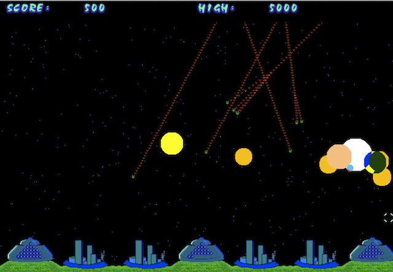

ICBM
===========

This is my take on a classic Atari video game, Missile Command.

Loading the page "Applet.html" within a browser should (maybe) start the program.
Failing that, from a command line you can try "appletviewer Applet.html".

